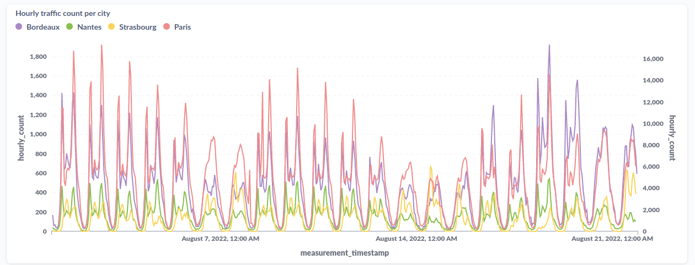
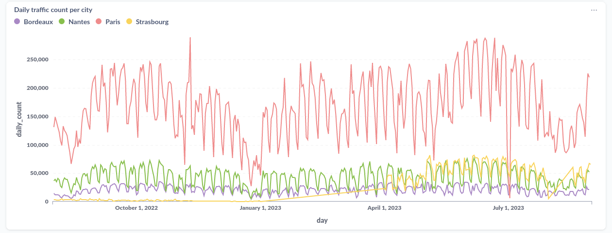

# VéloCityDB - Example Queries

All visualisations shown here have been generated using a [Metabase container](https://www.metabase.com/docs/latest/installation-and-operation/running-metabase-on-docker).

For a given month, get the hourly bicycle traffic count per city
```sql
SELECT SUM(hourly_traffic_count) as hourly_count,
       measurement_timestamp,
       city
FROM CityTrafficMeasurement
WHERE measurement_timestamp > "2022-08"
  AND measurement_timestamp < "2022-09"
GROUP BY measurement_timestamp, city;
```



For a given yearly period, get the daily bicycle traffic count per city
```sql
SELECT SUM(hourly_traffic_count)   as daily_count,
       date(measurement_timestamp) as day,
       city
FROM CityTrafficMeasurement
WHERE measurement_timestamp > "2022-08"
  AND measurement_timestamp < "2023-09"
GROUP BY day, city;
```

